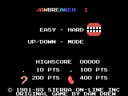
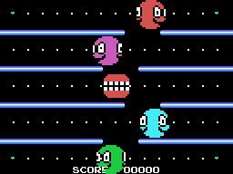
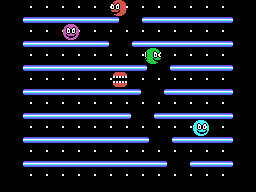
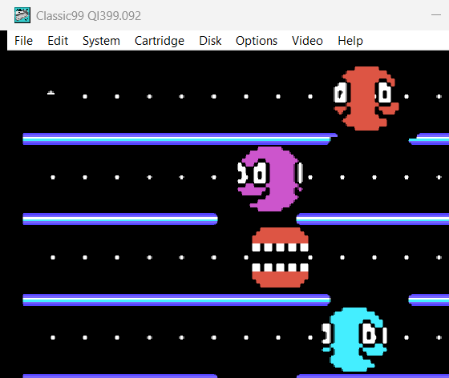

# Jawbreaker I + II Deluxe — TI-99/4A

A port of the MSX1 game **Jawbreaker I + II Deluxe Edition** to the TI-99/4A,
together with a verbatim copy of the MSX sources it was ported from.

The line of descent is a small circle: *Jawbreaker* is a Sierra On-Line game
from 1981–83, the TI-99/4A version of it was conceived by Dan Drew, Maggoo
wrote the MSX1 remake for MSXDEV 2014, and this repository brings that remake
back to the TI-99/4A.

| Menu | Jawbreaker II | Jawbreaker I |
|---|---|---|
|  |  |  |

*(Screens rendered out of the video memory of the simulator in `tools/`.)*

## What you need to run it

A plain TI-99/4A console. The game is a 32K cartridge and keeps all of its
variables in the 256 byte scratch pad, so **no memory expansion is required**.



- **Classic99** (<https://github.com/tursilion/classic99>, prebuilt in
  `dist/classic99.zip`) — `run-classic99.bat` builds the cartridge, copies it
  over and starts the emulator; or by hand:

  ```
  classic99.exe -rom jawbreaker2-8.bin
  ```

  Then press a key on the TI title screen and **2 for JAWBREAKER II**. Loading
  by hand through `Cartridge → User → Open` works too; the `…8.bin` suffix
  tells Classic99 that this is a bank switched cartridge.

  This is where the port has actually been run: title screen, menu, both game
  types, playing, dying and game over.
- **js99er** (<https://js99er.net>) — drag `build/jawbreaker2.rpk` onto the page.
- **MAME** — `mame ti99_4a -cart build/jawbreaker2.rpk` (needs the TI-99/4A
  system ROMs, which MAME does not ship).

## Controls

Joystick 1, or the keyboard:

| | |
|---|---|
| move | joystick, or **E / S / D / X** (up / left / right / down) |
| start, select | fire, **space** or **enter** |
| menu: easy / hard | left / right |
| menu: Jawbreaker I / II | up / down |

Move through the gaps in the sliding walls, eat every dot before the happy
faces catch you, and use an energizer to turn the tables for a few seconds.
Clear the screen and your teeth get brushed before the next level.

**Easy** runs the whole game at half speed, which is exactly what the MSX
version does with this setting.

## Building

Needs Python 3 and [xdt99](https://github.com/endlos99/xdt99) (`xas99.py`);
`java` is only used to pack the `.rpk`.

```bash
python tools/build.py
```

The build finds `xas99.py` next to the repository or on the path; set the
`XAS99` environment variable to point at it explicitly. On Windows `make.bat`
does the same thing. Output lands in `build/`:

- `jawbreaker2-8.bin` — 32K cartridge image, four 8K banks
- `jawbreaker2.rpk` — the same image packed for MAME and js99er
- `jawbreaker.lst` — assembly listing

`tools/conv_gfx.py` regenerates `src/gfx-*.a99` from the MSX data files and
runs as part of the build; `tools/conv_music.py` regenerates
`src/music-*.a99` from the PT3 modules and `tools/conv_sfx.py` regenerates
`src/sfx.a99` from the ayFX bank. All three outputs are checked in, so the
build works without rerunning them.

## Testing

`tools/sim99.py` is a small TMS9900 + TMS9918A simulator written for this
repository. It boots the cartridge image, runs it frame by frame, can hold
keys down at chosen frames and renders the video memory to a PNG:

```bash
python tools/sim99.py 260 --key=FIRE@20 --key=FIRE@60 --png=build/screen.png
```

It has no timing model and no GROM, so it says nothing about speed on real
hardware, but it is enough to walk the whole game: attraction screen, menu,
both game types, eating dots and energizers, monsters, dying, finishing a
level and game over have all been driven through it.

## Layout

```
src/          the TI-99/4A port, TMS9900 assembly for xas99
  jawbreaker.a99   memory map, cartridge header, main loop, bank helpers
  vdp.a99          VDP access, graphics loading
  sprite.a99       sprite engine and sprite descriptors
  game.a99         gameplay: player, dots, monsters, walls, bonus
  screens.a99      attraction screen, menu, ready, death, level end
  level.a99        level layouts, game start, difficulty
  text.a99         numbers and screen clearing
  input.a99        keyboard and joystick through the CRU
  sound.a99        SN76489 sound engine and effects
  data.a99         strings and tables that live in the data bank
  gfx-*.a99        generated graphics data
  music-*.a99      generated music, one tune per bank
  sfx.a99          generated sound effects
msx/          the MSX1 original, copied unchanged
tools/        graphics and music converters, build script, simulator
docs/         screen shots
```

## Differences from the MSX version

- **Music.** Both PT3 tunes play. The replayer from `msx/Code/PT3-ROM.ASM`
  is ported to Python (`tools/pt3.py`), runs the modules at build time and
  records the AY-3-8910 registers frame by frame; `tools/conv_music.py` maps
  those to the SN76489 and packs the differences. What the SN76489 cannot
  reproduce is the AY envelope, so the buzzy envelope bass keeps its notes but
  loses its timbre, and notes below about 110 Hz are shifted up an octave
  because the chip cannot go lower. The ten sound effects are converted from
  the MSX ayFX bank the same way, envelope by envelope, and take their channel
  back from the music while they play.
- **Graphics are identical.** Both machines use the TMS9918A, so every
  pattern, colour and sprite byte is reused unchanged, and the port keeps the
  MSX VRAM layout as well.
- The MSX sources in `msx/` are the ones handed over; as they stand they do
  not assemble, because the file that declares the RAM variables (`jawx`,
  `leveldata`, `mstdata`, …) is missing — `msx/Jawbreak2.lst` records 403
  "Label not found" errors from the 2020 build. The variable semantics were
  recovered from the code itself for the port; see `PORTING.md`.

## Credits

- Original game © 1981–83 Sierra On-Line
- TI-99/4A game concept: Dan Drew
- MSX version: Maggoo (MSXDEV 2014), music by Toni Cano-Caballero, artwork by
  Eric Boez
- This TI-99/4A port: translation of the MSX sources listed above
